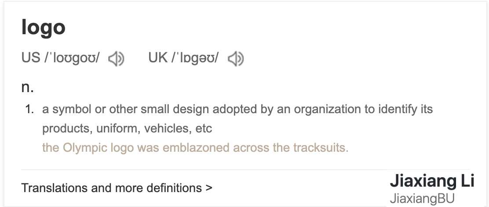
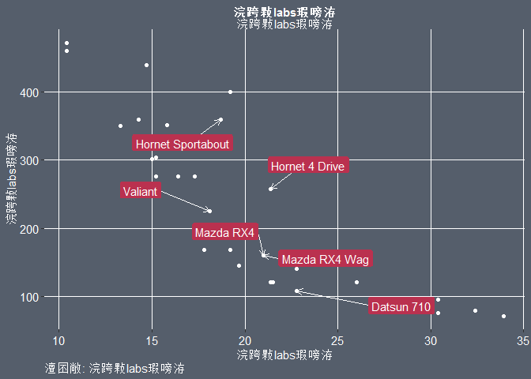
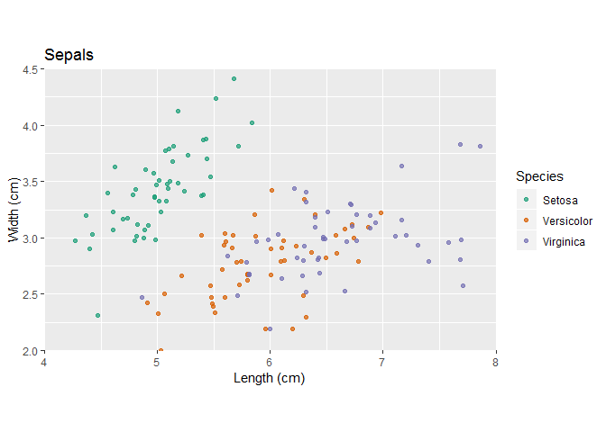
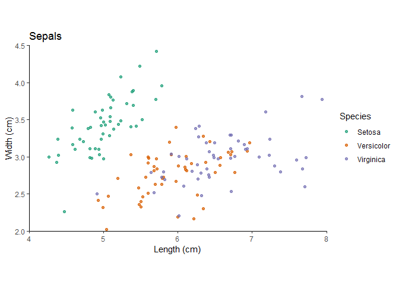

<!-- README.md is generated from README.Rmd. Please edit that file -->

# add2ggplot

<!-- badges: start -->

[](https://CRAN.R-project.org/package=add2ggplot)
<!-- badges: end -->

The goal of add2ggplot is to add more theme for your ggplot object.

## Installation

You can install the released version of add2ggplot from
[CRAN](https://CRAN.R-project.org) with:

``` r
install.packages("add2ggplot")
```

And the development version from [GitHub](https://github.com/) with:

``` r
# install.packages("devtools")
devtools::install_github("JiaxiangBU/add2ggplot")
```

## Examples

``` r
library(add2ggplot)
#> Registered S3 methods overwritten by 'ggplot2':
#>   method         from 
#>   [.quosures     rlang
#>   c.quosures     rlang
#>   print.quosures rlang
```

``` r
plot_logo <- add_logo(
  plot_path = "inst/extdata/logo.png",
  logo_path = "inst/extdata/jiaxiang.png",
  logo_position = "bottom right",
  logo_scale = 5)
plot_logo
```



``` r
library(ggrepel)
#> Warning: package 'ggrepel' was built under R version 3.6.1
#> Loading required package: ggplot2
df <- 
mtcars %>%
    tibble::rownames_to_column()
```

``` r
df %>%
    ggplot() +
    aes(mpg, disp, label = rowname) +
    geom_point(color = 'white') +
    # geom_label_repel use fill arg in the segments.
    geom_label_repel(
        data = function(x)
            df %>% head,
        arrow = arrow(length = unit(0.02, "npc")),
        box.padding = 1,
        segment.color = white_one,
        color = white_one,
        label.size = NA,
        fill = red_two,
        aes(face = "bold")
    ) +
    # theme_white()
    theme_grey_and_red() +
    labs(
        title = '浣跨敤labs瑕嗙洊',
        subtitle = '浣跨敤labs瑕嗙洊',
        x = '浣跨敤labs瑕嗙洊',
        y = '浣跨敤labs瑕嗙洊',
        caption = '澶囨敞: 浣跨敤labs瑕嗙洊'
    )
#> Warning: Ignoring unknown aesthetics: face
```



``` r
z <-
    ggplot(iris, aes(x = Sepal.Length, y = Sepal.Width, col = Species)) +
    geom_jitter(alpha = 0.7) +
    scale_color_brewer(
        "Species",
        palette = "Dark2",
        labels = c("Setosa",
                   "Versicolor",
                   "Virginica")
    ) +
    scale_y_continuous("Width (cm)",
                       limits = c(2, 4.5),
                       expand = c(0, 0)) +
    scale_x_continuous("Length (cm)", limits = c(4, 8), expand = c(0, 0)) +
    ggtitle("Sepals") +
    coord_fixed(1)
```

``` r
z
```



``` r
z + theme_classic()
```



``` r
z + theme_classic2()
```


<h4 align="center">

**Code of Conduct**

</h4>

<h6 align="center">

Please note that the `add2ggplot` project is released with a
[Contributor Code of
Conduct](https://github.com/JiaxiangBU/add2ggplot/blob/master/CODE_OF_CONDUCT.md).<br>By
contributing to this project, you agree to abide by its terms.

</h6>

<h4 align="center">

**License**

</h4>

<h6 align="center">

MIT © [Jiaxiang Li;Nakagawara
Ryo](https://github.com/JiaxiangBU/add2ggplot/blob/master/LICENSE.md)

</h6>
